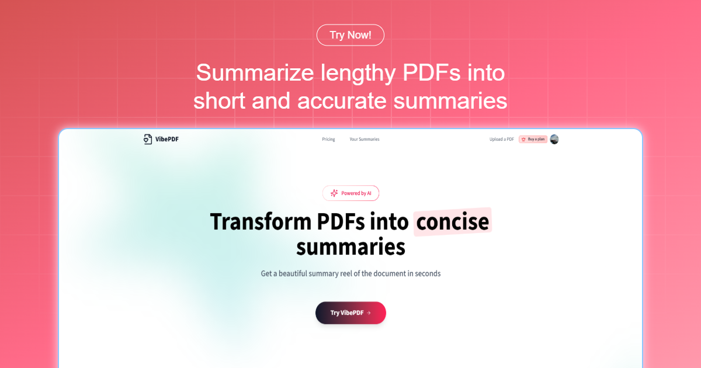
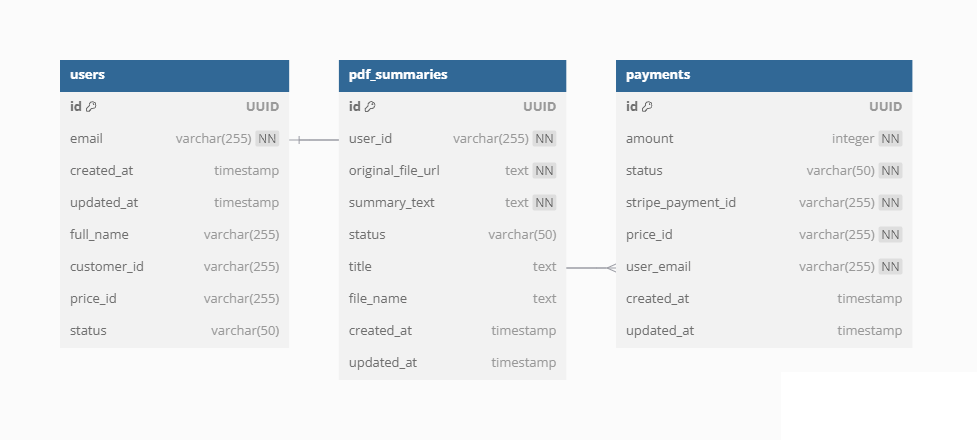

# VibePDF

A modern web application for processing and summarizing PDF documents using AI, built with Next.js 15 and TypeScript. Click [here](https://vibe-pdf.vercel.app/) to check out the live demo!



## 🌟 Features

- **PDF Processing & Summarization**

  - Upload and process PDF documents
  - AI-powered document summarization using multiple models (OpenAI and Gemini)
  - Secure file storage and management

- **Authentication & Authorization**

  - Secure user authentication powered by Clerk
  - Protected routes and API endpoints
  - User profile management

- **Payment Integration**

  - Stripe payment processing
  - Subscription management
  - Usage tracking and billing

## 🛠️ Technologies Used

- **Frontend:**

  - Next.js 15.3.0 (with App Router)
  - React 19
  - Tailwind CSS
  - ShadCN UI components
  - Lucide React icons
  - Motion

- **Backend:**

  - Next.js API routes
  - NeonDB (PostgreSQL)
  - LangChain
  - OpenAI / Gemini

- **Authentication:**

  - Clerk

- **File Handling:**

  - UploadThing

- **Payments:**

  - Stripe

## 🚀 Getting Started

### Prerequisites

- Node.js (Latest LTS version recommended)
- PostgreSQL database (NeonDB)
- Clerk account for authentication
- UploadThing account for file uploads
- Stripe account for payments
- OpenAI API key and/or Gemini API key

### Environment Variables

Create a `.env.local` file with the following variables:

```env
# Authentication (Clerk)
NEXT_PUBLIC_CLERK_PUBLISHABLE_KEY=
CLERK_SECRET_KEY=

# Database (NeonDB)
DATABASE_URL=

# File Upload (UploadThing)
UPLOADTHING_TOKEN=

# AI Services
OPENAI_API_KEY=
GEMINI_API_KEY=

# Payments (Stripe)
STRIPE_SECRET_KEY=
STRIPE_WEBHOOK_SECRET=

# Node Environment (development or production)
NODE_ENV=
```

### Installation

1. Clone the repository:

```bash
git clone https://github.com/NNikoGG/vibe-pdf.git
cd vibe-pdf
```

2. Install dependencies:

```bash
npm install
```

3. Set up the database:

```bash
# Run the SQL schema
# Use the schema.sql file provided in the project
```

4. Run the development server:

```bash
npm run dev
```

## 🏗️ Project Structure

- `/app` - Next.js application routes and layouts

  - `/api` - API routes
  - `/logged-in` - Protected routes
  - `/sign-in`, `/sign-up` - Authentication pages

- `/actions` - Server actions

  - `upload-actions.ts` - File upload handling
  - `summary-actions.ts` - PDF summarization logic

- `/components` - React components

  - `/upload` - File upload components
  - `/ui` - Shared UI components
  - `/common` - Common components
  - `/summaries` - Summary-related components
  - `/home` - Homepage components

- `/lib` - Core functionality

  - `user.ts` - User management
  - `summaries.ts` - Summary processing
  - `payments.ts` - Payment handling
  - `langchain.ts` - AI integration
  - `openai.ts` - OpenAI configuration
  - `geminiai.ts` - Gemini configuration

- `/utils` - Helper functions and constants
  - `constants.ts` - Application constants
  - `prompts.ts` - AI prompt templates
  - `summary-helper.ts` - Summary processing utilities

## 📊 Database Schema

The application uses a PostgreSQL database with the following main tables:

- `users` - User information and subscription status
- `pdf_summaries` - Processed PDF documents and their summaries
- `payments` - Payment and subscription records



## 👥 Contributions

Contributions are welcome! If you have any ideas or suggestions for improvements, please feel free to open an issue or submit a pull request.
